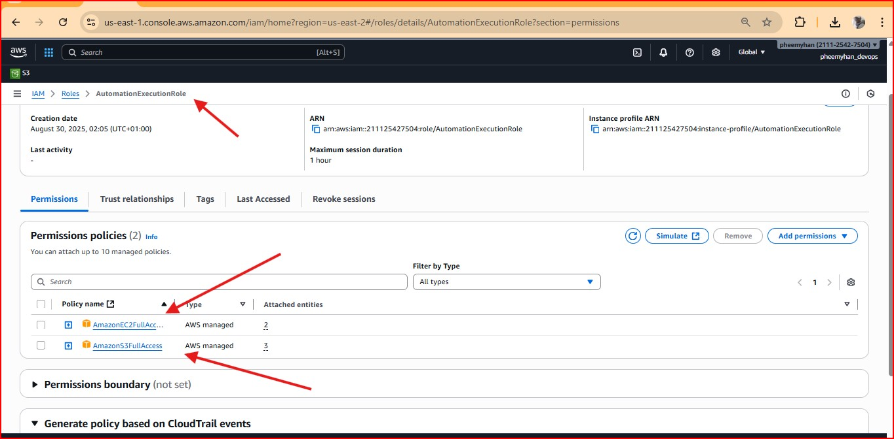
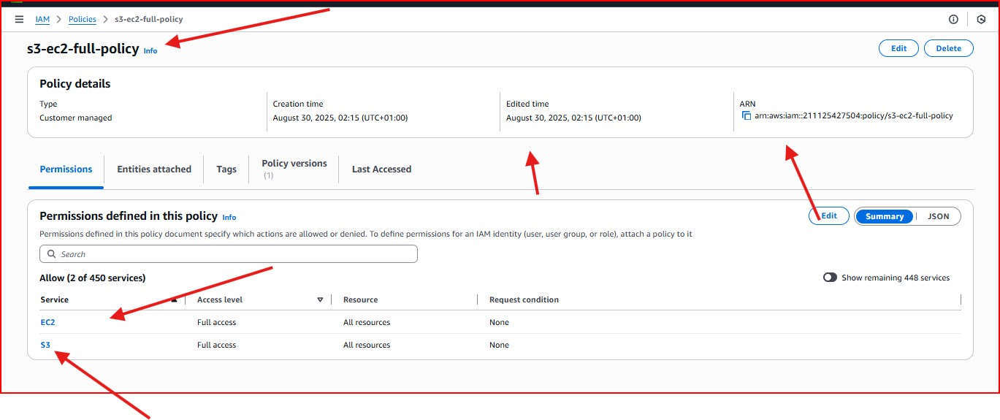
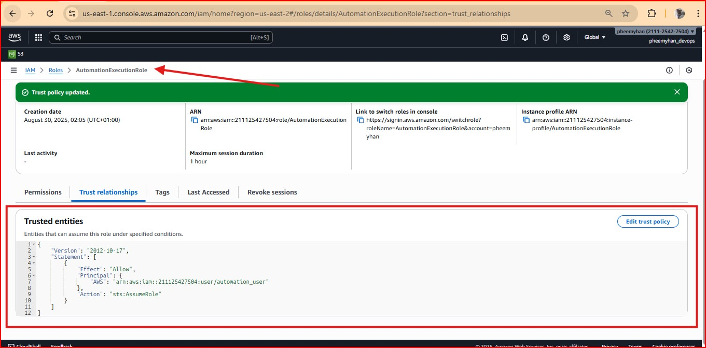
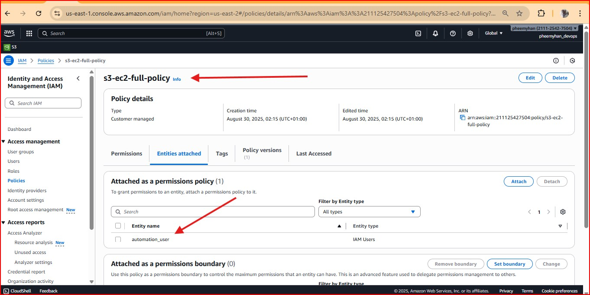
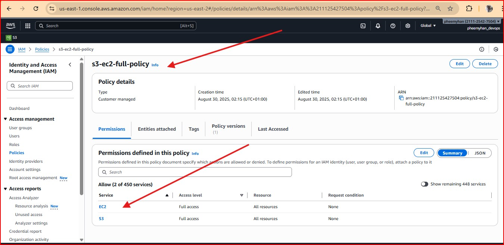
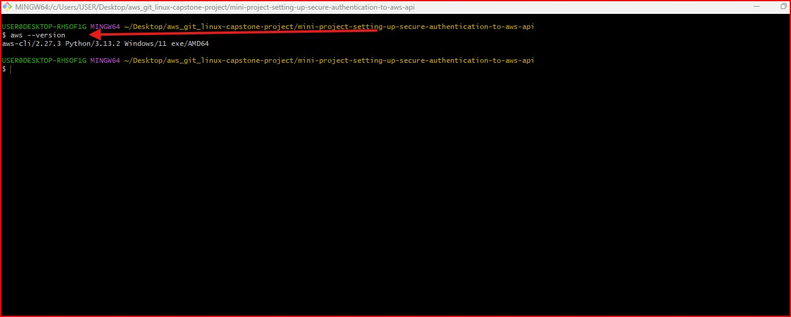
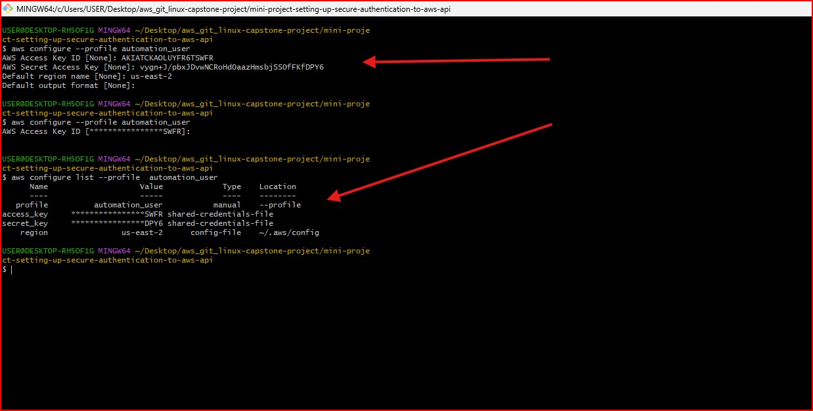
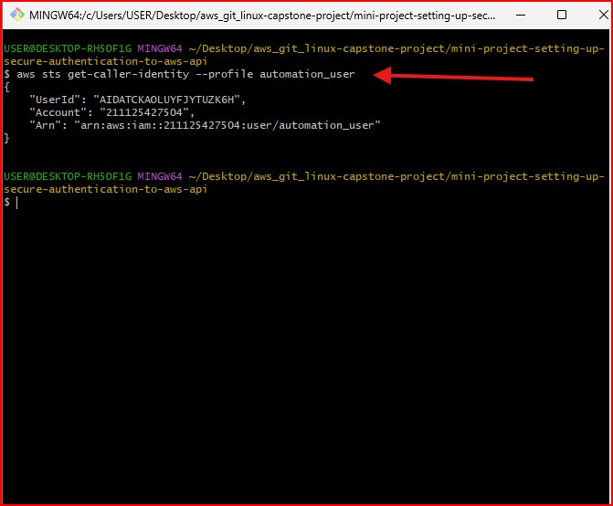
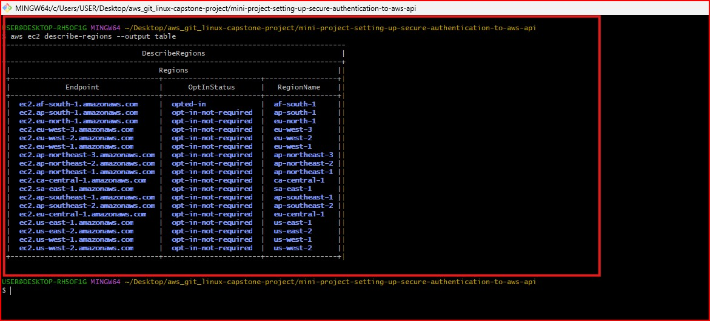
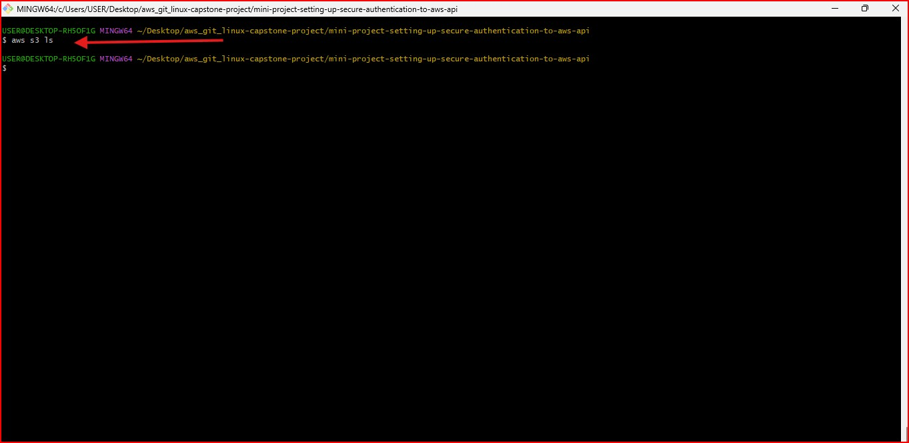

# Readme URL Below: 

https://github.com/Agbedeyisegun/3mtt-project/blob/main/darey.io/mini-project-setting-up-secure-authentication-to-aws-api/README.md

# AWS CLI Configuration & Automation Setup

## Project Description
This project documents the complete process of setting up AWS Command Line Interface (CLI) for secure programmatic access to AWS services. It covers IAM configuration, CLI installation, authentication setup, and verification procedures for cloud automation tasks.

## Prerequisites
- Active AWS account with admin privileges
- Terminal access (Linux/macOS) or Command Prompt (Windows)
- curl utility (for Linux installation)
- Administrator/sudo privileges

---

## Step 1: IAM Configuration for Automation

### 1.1 Create IAM Role

- Navigate to IAM > Roles > Create role
- Select **EC2** as the trusted entity
- Attach permissions policies: `AmazonEC2FullAccess` and `AmazonS3FullAccess`
- Name the role: `AutomationExecutionRole`

### 1.2 Create IAM Policy

{
    "Version": "2012-10-17",
    "Statement": [
        {
            "Effect": "Allow",
            "Action": [
                "ec2:*",
                "s3:*"
            ],
            "Resource": "*"
        }
    ]
}
1.3 Create IAM User
Go to IAM > Users > Add user

Set username: automation_user

Important: Store the generated credentials securely

1.4 Attach Permissions
Attach the created policy directly to the user

Assign the IAM role to the user

Verifying the entity attached to the IAM policy to confirm it is the user created.

Verify permissions in the "Permissions" tab

Step 2: AWS CLI Installation
For Linux Systems

# Download AWS CLI v2
curl "https://awscli.amazonaws.com/awscli-exe-linux-x86_64.zip" -o "awscliv2.zip"

# Extract package
unzip awscliv2.zip

# Install with sudo
sudo ./aws/install

# Verify installation
aws --version
For Windows Systems
Download the MSI installer from AWS CLI Download Page

Run the installer as Administrator

Open new Command Prompt and verify:

cmd : aws --version

Step 3: AWS CLI Configuration

cmd : aws configure --profile automation_user
When prompted, enter:

AWS Access Key ID: From created IAM user

AWS Secret Access Key: From IAM user creation

Default region name: us-east-2 

Default output format: json

Configuration files are stored in:

Windows: ~/.aws/credentials and ~/.aws/config

Step 4: Verification & Testing
4.1 Verify CLI Access

aws sts get-caller-identity --profile automation_user 
Expected output shows your account ID and user ARN.

4.2 Test EC2 Access

cmd : aws ec2 describe-regions --output table
This should display all available AWS regions in a formatted table.

4.3 Test S3 Access

cmd : aws s3 ls
Lists all S3 buckets in your account (if any exist).

Security Best Practices
Credential Protection:

Never commit credentials to version control

Use AWS CLI named profiles for multiple accounts

Enable MFA for IAM users

Permission Management:

Follow principle of least privilege

Regularly audit IAM policies

Rotate access keys every 90 days

Configuration Tips:

# Set default region for all commands
aws configure set default.region us-west-2
